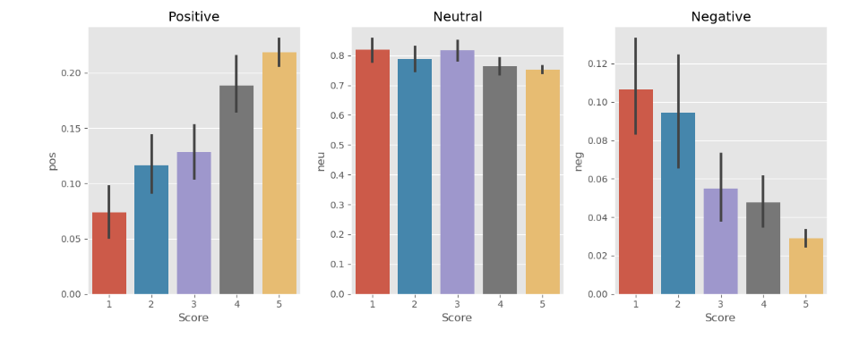

# Sentiment Analysis using VADER

This repository contains a notebook for a sentiment analysis using the [NLTK VADER](https://www.nltk.org/api/nltk.sentiment.html) sentiment analyzer to classify a subset of Amazon e-commerce reviews. Additionally, the relationship between sentiment scoring and the Amazon review ratings system was explored.

Data source from Kaggle: [Amazon Reviews Dataset.](https://www.kaggle.com/code/robikscube/sentiment-analysis-python-youtube-tutorial/input)

### Conclusion

The following plot showcases that the VADER scoring system accurately reflects Positive, Neutral, and Negative sentiments for reviews where a 5-star review is considered to be very positive and a 1-star review is considered to be very negative. 

